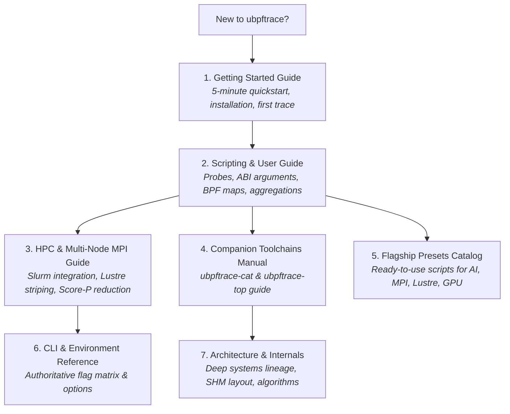

# ubpftrace Documentation Hub

Welcome to the official documentation for **`ubpftrace`**, the unprivileged, zero-jitter userspace eBPF dynamic tracing engine designed for High-Performance Computing (HPC), Distributed AI, and Parallel Storage Systems.

---

## Documentation Roadmap

---

## Core Documentation Guides

### 🚀 [1. Getting Started Guide](getting_started.md)
A hands-on, step-by-step introduction:
- Prerequisites & Single-step build (`./scripts/build_hpc.sh`)
- Tracing your first application with `uprobes`
- Working with statistical BPF maps (`count()`, `sum()`, `avg()`, `hist()`)
- Real-time terminal streaming (`--stream`)
- Launching the interactive cluster dashboard (`ubpftrace-top`)
- Decoding trace containers (`ubpftrace-cat`)

---

### 📖 [2. Scripting & User Guide](user_guide.md)
The complete language and programming reference for `ubpftrace`:
- **Probe Attachment**: `uprobe`, `uretprobe`, `BEGIN`, `END`
- **Function Arguments (x86_64 ABI)**: 0-indexed arguments (`arg0`..`arg5`), return values (`retval`)
- **HPC Builtins**: `rank`, `node`, `local_rank`, `nodename`, `lustre_ost`, `nsecs`, `elapsed`, `pid`, `tid`
- **Aggregation Functions**: `count()`, `sum()`, `avg()`, `min()`, `max()`, `hist()`, `lhist()`
- **Map Lifecycle**: `clear()`, `delete()`, `print()`, type-safety & arithmetic casting
- **Telemetry Modes**: In-band streaming vs. Post-run time bucketing vs. Periodic JSON snapshots

---

### 🌐 [3. HPC, MPI & Lustre Storage Guide](hpc_and_mpi_guide.md)
Production deployment across large-scale supercomputing clusters:
- **Zero-Jitter Invariants**: Why `ubpftrace` introduces $< 0.1\%$ application overhead
- **Multi-Node Slurm & MPI Execution**: Launching with `srun` and `mpirun`
- **Lustre Parallel Filesystem Optimizations**: 1 container file per node, 2MB OST stripe alignment, `O_DIRECT` bypass
- **Score-P Style MPI Reduction**: Isolated communicator duplication (`MPI_Comm_dup`), $O(\log N)$ binomial tree reduction to `_summary.json`

---

### 🛠️ [4. Companion Toolchains Manual](toolchains.md)
Comprehensive reference for post-mortem decoding and real-time operations:
- **`ubpftrace-cat`**:
  - Container inspection (`--info`)
  - Chronological event dumping (`--dump`)
  - Multi-node K-way min-heap merge (`--merge`)
  - Google Chrome & Perfetto timeline visualizer export (`--chrome`)
- **`ubpftrace-top`**:
  - Interactive ANSI TUI dashboard
  - Automated cluster variance and straggler node detection
  - Machine-readable streaming (`--json`) for Prometheus / Grafana

---

### 📦 [5. Production Presets Catalog](presets_catalog.md)
Six turnkey, production-validated tracing scripts:
1. **`ai_checkpoint_lustre.bt`**: Distributed AI checkpointing bandwidth and Lustre OST latency profiling
2. **`mpi_straggler_detector.bt`**: Collective synchronization skews and slow-node identification
3. **`mpi_p2p_traffic.bt`**: Point-to-point communication volume and message heatmaps
4. **`openmp_hybrid_contention.bt`**: OpenMP barrier wait time and lock contention in hybrid MPI+OpenMP
5. **`cuda_sync_bubbles.bt`**: Host-device CUDA synchronization latency bubbles and API blocking
6. **`nccl_collective_skew.bt`**: Multi-GPU AllReduce ring latency and cross-rank synchronization skew

---

### ⚙️ [6. Authoritative CLI & Environment Reference](cli_reference.md)
Full parameter dictionary:
- All CLI flags for `ubpftrace`, `ubpftrace-cat`, and `ubpftrace-top`
- Complete table of environment variables (`UBPFTRACE_OUTPUT_DIR`, `UBPFTRACE_LIVE_DIR`, `UBPFTRACE_STREAM`, etc.)

---

### 🏛️ [7. Systems Architecture & Deep Internals](architecture_and_internals.md)
Publication-grade systems treatise:
- Lineage from eBPF, bpftrace, Score-P, and bpftime
- Lock-free dual-epoch hazard double-buffering algorithm
- Memory structures, struct alignments (`alignas(64)`), and binary layout of `.ubpf` containers
