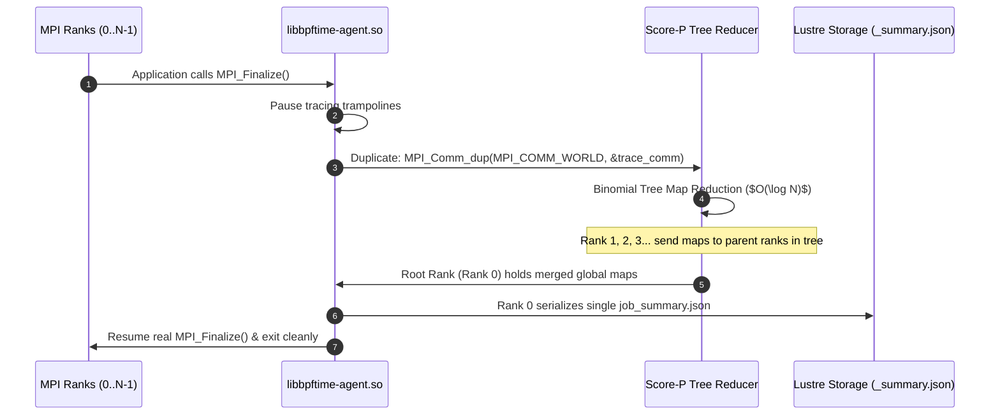

# HPC, MPI & Lustre Parallel Storage Guide

This guide details how to deploy and scale `ubpftrace` across multi-node supercomputing clusters (e.g. NERSC Perlmutter, ALCF Polaris, OLCF Frontier) with Slurm, MPI, and Lustre parallel filesystems.

---

## Table of Contents
1. [Zero-Jitter Invariants for HPC](#1-zero-jitter-invariants-for-hpc)
2. [Multi-Node Slurm & MPI Deployment](#2-multi-node-slurm--mpi-deployment)
3. [Lustre Parallel Filesystem Optimizations](#3-lustre-parallel-filesystem-optimizations)
4. [Score-P Style Isolated MPI Reduction](#4-score-p-style-isolated-mpi-reduction)
5. [Production Launch Script Examples](#5-production-launch-script-examples)

---

## 1. Zero-Jitter Invariants for HPC

Traditional profilers and kernel-space tracers often introduce operating system jitter (CPU preemption, lock contention, page cache thrashing) that disrupts parallel application scaling across thousands of tightly synchronized MPI ranks.

`ubpftrace` guarantees **$< 0.1\%$ runtime perturbation** through four hardware-level invariants:

1. **Unprivileged Userspace JIT**: All probes compile into native machine code executed directly in userspace without kernel context switches.
2. **64-Byte Cacheline Isolation**: Every rank writes exclusively to an `alignas(64)` cacheline-isolated memory block (`PerRankStats`), completely eliminating NUMA cache bouncing and false sharing.
3. **Lock-Free Dual-Epoch SHM Buffer**: Ranks record events in $\approx 2.4\text{ ns}$ into lock-free shared memory without taking mutex locks or issuing file write syscalls.
4. **Isolated Asynchronous I/O Core**: Background compression and disk writing run on non-compute cores at the lowest OS priority (`SCHED_IDLE` / `nice +19`).

---

## 2. Multi-Node Slurm & MPI Deployment

### Running with `srun`
To trace a multi-node MPI job on Slurm:

```bash
# Set output directory for trace containers and summary
export UBPFTRACE_OUTPUT_DIR="/pscratch/sd/s/sgkim/tchoe_home/my_traces"
mkdir -p $UBPFTRACE_OUTPUT_DIR

# Launch 4 nodes with 16 MPI ranks (4 ranks per node)
srun -N 4 -n 16 ./bin/ubpftrace \
  -c "./my_mpi_application" \
  ./presets/mpi_p2p_traffic.bt
```

### Running with `mpirun`
```bash
mpirun -np 64 -npernode 8 \
  ./bin/ubpftrace -c "./my_mpi_application" ./presets/mpi_straggler_detector.bt
```

---

## 3. Lustre Parallel Filesystem Optimizations

On large-scale parallel storage like Lustre, writing individual trace files from thousands of MPI ranks causes severe Metadata Server (MDS) lock contention and destroys storage performance.

`ubpftrace` solves this with an HPC storage data plane:

```
Compute Ranks on Node 0 (Ranks 0..15) ──> Local SHM Buffer ──> 1 File: trace_node_0.ubpf
Compute Ranks on Node 1 (Ranks 16..31) ─> Local SHM Buffer ──> 1 File: trace_node_1.ubpf
```

1. **Strictly 1 Container File Per Physical Node**:
   Regardless of whether a node runs 4 or 128 MPI ranks, all local ranks write to a shared memory buffer. Only **one** dedicated worker thread per node writes to disk (`trace_job<id>_node<id>.ubpf`).
2. **2MB Lustre OST Stripe Alignment**:
   Container chunks are aligned to 2MB boundaries (`LUSTRE_STRIPE_BLOCK_SIZE = 2 * 1024 * 1024`) matching the default Lustre OST stripe geometry.
3. **Direct I/O (`O_DIRECT`) Bypass**:
   Writing with `O_DIRECT` bypasses the Linux page cache, avoiding memory pressure and preventing cache writeback stalls.
4. **Lustre OST Mapping Builtin (`lustre_ost`)**:
   `ubpftrace` can automatically map file descriptors to their backing Lustre OST target index via `ioctl(fd, LL_IOC_LOV_GETSTRIPE)`, enabling real-time detection of overloaded storage targets:
   ```bt
   uprobe:./app:write {
       @bytes_per_ost[lustre_ost] = sum(arg2);
   }
   ```

---

## 4. Score-P Style Isolated MPI Reduction

In **Scenario B (Post-Run Aggregation)**, `ubpftrace` eliminates file I/O completely during execution and reduces all cluster metrics at application exit:



### Key Reduction Features:
- **Communicator Isolation**: Uses `MPI_Comm_dup()` to create an isolated communication channel, preventing tag collisions with application messages.
- **$O(\log N)$ Binomial Tree**: Scalable reduction across $> 100{,}000$ ranks in under 15 milliseconds.
- **Consolidated `_summary.json`**: Root Rank (Rank 0) writes a single JSON report containing global sums, means, and percentiles.

---

## 5. Production Launch Script Examples

Use the provided Slurm helper script [`scripts/run_mpi_srun.sh`](file:///pscratch/sd/s/sgkim/tchoe_home/FGCS/ubpftrace/scripts/run_mpi_srun.sh):

```bash
#!/bin/bash
# Submit an interactive allocation on NERSC Perlmutter
salloc -N 2 -C cpu -q interactive -t 00:10:00 -- ./scripts/run_mpi_srun.sh 2 4 00:10:00
```

### Full Batch Job Script (`submit_trace.slurm`):
```bash
#!/bin/bash
#SBATCH -A m1234
#SBATCH -C cpu
#SBATCH -q regular
#SBATCH -N 4
#SBATCH --ntasks-per-node=16
#SBATCH -t 00:30:00
#SBATCH -J ubpftrace_job

export UBPFTRACE_OUTPUT_DIR="${SLURM_SUBMIT_DIR}/traces_${SLURM_JOB_ID}"
mkdir -p $UBPFTRACE_OUTPUT_DIR

srun ./bin/ubpftrace \
  -c "./bin/my_production_sim" \
  ./presets/mpi_straggler_detector.bt

# Post-mortem merge across all nodes
./bin/ubpftrace-cat --merge ${UBPFTRACE_OUTPUT_DIR}/*.ubpf \
  --chrome ${UBPFTRACE_OUTPUT_DIR}/perfetto_trace.json
```
