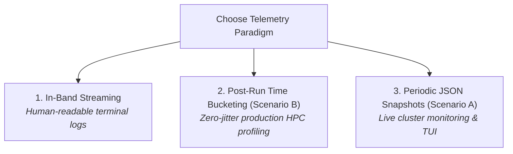

# ubpftrace Scripting & User Guide

This guide is the comprehensive reference for writing `ubpftrace` scripts. It covers probe syntax, calling conventions, HPC-aware builtins, associative map operations, aggregation functions, and execution paradigms.

---

## Table of Contents
1. [Probe Types & Attachment Syntax](#1-probe-types--attachment-syntax)
2. [Function Arguments & Calling Conventions (x86_64 ABI)](#2-function-arguments--calling-conventions-x86_64-abi)
3. [HPC Cluster & Process Context Builtins](#3-hpc-cluster--process-context-builtins)
4. [BPF Maps & Associative Arrays](#4-bpf-maps--associative-arrays)
5. [Builtin Aggregation Functions](#5-builtin-aggregation-functions)
6. [Control Flow, Scratch Variables & Type Safety](#6-control-flow-scratch-variables--type-safety)
7. [The Three Operational Telemetry Paradigms](#7-the-three-operational-telemetry-paradigms)

---

## 1. Probe Types & Attachment Syntax

Probes define the dynamic interception points where your tracing logic executes.

### Syntax Specification

| Probe Syntax | Trigger Moment | Typical Use Case |
| :--- | :--- | :--- |
| `uprobe:<binary_path>:<function_symbol>` | Function entry | Inspect input parameters (`arg0`..`arg5`), start timestamps |
| `uretprobe:<binary_path>:<function_symbol>` | Function exit / return | Calculate function duration, inspect return values (`retval`) |
| `BEGIN` | Initialization | Initialize global timestamps, print startup headers |
| `END` | Teardown / Exit | Print final summaries, clear temporary variables |

### Examples

```bt
// Trace function entry in a target binary
uprobe:/usr/bin/python3:PyObject_Call
{
    @py_calls = count();
}

// Calculate function execution latency
uprobe:/path/to/app:matrix_multiply
{
    @start_time[tid] = nsecs;
}

uretprobe:/path/to/app:matrix_multiply
{
    if (@start_time[tid] > 0) {
        $latency_us = (nsecs - @start_time[tid]) / 1000;
        @matmul_latency_us = hist($latency_us);
        delete(@start_time[tid]);
    }
}
```

---

## 2. Function Arguments & Calling Conventions (x86_64 ABI)

In `ubpftrace`, function parameters inside `uprobe` are **0-indexed** according to the standard x86_64 System V AMD64 Calling Convention:

| C Function Parameter | Machine Register | ubpftrace Keyword |
| :--- | :--- | :--- |
| **1st Parameter** (e.g. `foo(int a, ...)`) | `%rdi` | **`arg0`** |
| **2nd Parameter** | `%rsi` | **`arg1`** |
| **3rd Parameter** | `%rdx` | **`arg2`** |
| **4th Parameter** | `%rcx` | **`arg3`** |
| **5th Parameter** | `%r8` | **`arg4`** |
| **6th Parameter** | `%r9` | **`arg5`** |
| **Return Value** (in `uretprobe`) | `%rax` | **`retval`** |

### Example: Tracing a C Function with Multiple Parameters
Suppose your C application has:
```c
ssize_t write_payload(int fd, const void *buf, size_t count);
```

You can trace it in `ubpftrace` as follows:
```bt
uprobe:./my_app:write_payload
{
    $fd    = arg0;       // 1st argument (int fd)
    $buf   = arg1;       // 2nd argument (pointer)
    $count = arg2;       // 3rd argument (size_t count)

    @bytes_per_fd[$fd] = sum($count);
    @write_sizes = hist($count);
}
```

---

## 3. HPC Cluster & Process Context Builtins

`ubpftrace` extends standard tracing with first-class primitives for high-performance computing, distributed MPI, and parallel storage systems:

```bt
// Cluster & Topology Builtins
rank        // Global MPI Rank (0 .. N-1), defaults to 0 in non-MPI workloads
node        // Physical Node ID (64-bit FNV-1a hash of physical hostname)
local_rank  // Local rank index within the physical compute node (0 .. local_size-1)
nodename    // Hostname string of the physical machine (e.g. "nid001234")
lustre_ost  // Lustre OST target index resolved via ioctl(LL_IOC_LOV_GETSTRIPE)

// Process & Thread Identifiers
pid         // Process ID of the traced application
tid         // Thread ID of the currently executing thread
comm        // Command/process name string (e.g. "hpc_app")

// High-Resolution Monotonic Clocks
nsecs       // Nanoseconds on CLOCK_MONOTONIC (uint64)
elapsed     // Nanoseconds elapsed since probe engine initialization
```

### Example: Multi-Rank MPI Communication Profiler
```bt
uprobe:./mpi_app:MPI_Send
{
    $count = arg1;
    $dest  = arg3;
    $tag   = arg4;

    // Track total bytes sent from this rank to destination ranks
    @p2p_traffic[rank, $dest] = sum($count);
}
```

---

## 4. BPF Maps & Associative Arrays

BPF Maps are high-performance in-memory key-value stores maintained in shared memory across probes.

### Variable Scopes
- **Scratch Variables (prefix `$`)**: Local to the probe invocation, stored in CPU registers or stack. Example: `$sec = (nsecs - @start) / 1000000000;`
- **Map Variables (prefix `@`)**: Globally persistent across probe invocations and threads. Example: `@call_count[rank] = count();`

### Multi-Key Map Indexing
Maps support single or composite tuple keys:
```bt
@traffic[rank, $dest, $tag] = sum($bytes);
@io_by_ost[node, lustre_ost] = count();
```

### Map Management Commands
```bt
clear(@map_name);            // Empties all entries from the map
delete(@map_name[key]);      // Removes a specific key-value entry
print(@map_name);            // Formats and prints the map to stdout
```

---

## 5. Builtin Aggregation Functions

`ubpftrace` implements hardware-optimized, lock-free aggregation primitives:

### Summary Aggregations
- **`count()`**: Counts the number of times an event occurs.
  ```bt
  @calls = count();
  ```
- **`sum(val)`**: Accumulates the arithmetic sum of `val`.
  ```bt
  @total_bytes = sum(arg1);
  ```
- **`avg(val)`**: Computes the running incremental average.
  ```bt
  @avg_msg_size = avg(arg1);
  ```
- **`min(val)` / `max(val)`**: Tracks the minimum / maximum observed value.
  ```bt
  @min_lat = min($lat);
  @max_lat = max($lat);
  ```

### Distribution Histograms
- **`hist(val)`**: Power-of-2 logarithmic histogram (ideal for message sizes and latency spreads).
  ```bt
  @io_size_hist = hist(arg2);
  ```
- **`lhist(val, min, max, step)`**: Linear histogram with fixed intervals.
  ```bt
  // Linear histogram from 0 to 100 with bucket width 5
  @progress_hist = lhist($pct, 0, 100, 5);
  ```

---

## 6. Control Flow, Scratch Variables & Type Safety

### Conditionals
Standard C-style `if-else` branching is supported:
```bt
uprobe:./app:process_task
{
    if (arg0 > 1000) {
        @large_tasks = count();
    } else {
        @small_tasks = count();
    }
}
```

### Unsigned Arithmetic & Casting
To prevent signed arithmetic overflow warnings, use unsigned integer casting:
```bt
$sec = (nsecs - @start_ns) / (uint64)1000000000;
$kb  = (uint64)arg0 / 1024;
```

---

## 7. The Three Operational Telemetry Paradigms

Depending on your profiling goal, choose one of the three execution paradigms:



### Paradigm 1: In-Band Script Streaming
- **Best for**: Single-process interactive terminal debugging.
- **How to run**:
  ```bash
  ubpftrace --stream -c "./simple" trace_stream.bt
  ```

### Paradigm 2: Post-Run Time-Bucketed Aggregation (Scenario B)
- **Best for**: Large-scale multi-rank MPI runs requiring strict zero-jitter guarantees.
- **Script Pattern**:
  ```bt
  uprobe:./simple:foo {
      $sec = (nsecs - @start_ns) / (uint64)1000000000;
      @sum_per_sec[$sec] = sum(arg0);
  }
  ```
- **How to run**:
  ```bash
  ubpftrace -c "./simple" trace_postrun.bt
  ```

### Paradigm 3: Out-of-Band Periodic JSON Snapshots (Scenario A)
- **Best for**: Cluster-wide real-time telemetry and straggler node detection.
- **Script Pattern**: Simple in-memory maps (`@sum = sum(arg0);`).
- **How to run**:
  ```bash
  # Tracing Process
  ubpftrace -L 1 --live-dir ./snapshots -c "./simple" trace_live.bt

  # Dashboard (in 2nd terminal)
  ubpftrace-top --dir ./snapshots
  ```
